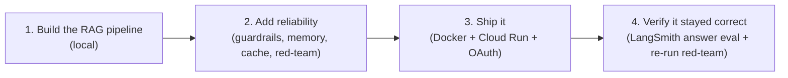

# 01. Overview & Problem

## The problem

Employees keep asking HR the same questions — *"How many leave days do I
get?"*, *"What's the notice period?"*, *"Can I work from home every day?"*
The answers all live in HR policy documents nobody wants to dig through.

The **HR Policy Assistant** is a chatbot that answers these by actually
reading the company's real HR policy documents and quoting from them — not
by guessing.

## Why this is harder than "just ask ChatGPT"

A generic model was never shown your company's policies. Two things have to
happen:

1. **Give the model the actual policy text** at answer time — this is
   **RAG** (Retrieval-Augmented Generation): find the relevant document
   first, then let the model answer using only that.
2. **Keep it honest and in-scope** — it must say "I don't know" when the
   answer isn't in the documents, and must refuse questions outside HR
   (company financials, other departments' data), even when asked cleverly.

## Who it's for

Any employee with a Google account on an approved list. They open a web
page, log in with Google, and ask in plain English.

## The four stages this project went through

- **Stage 1** — a working local Streamlit/CLI app: read HR docs, embed
  them, store in a vector database, answer with Vertex AI Gemini.
  (Docs 03–08.)
- **Stage 2** — made it *reliable*: safety guardrails, a scope filter, a
  semantic cache, short-term memory, an adversarial red-team pass.
  (Docs 09–10.)
- **Stage 3** — made it a hosted product: containerized, deployed to
  Google Cloud Run, gated behind company Google logins, with every LLM
  call routed through one function (Gemini primary, Groq fallback).
  (Docs 11–16.)
- **Stage 4** — re-ran the quality and safety checks against the deployed
  system. (Doc 10.)

## What "done" looks like

| Service | What it is | Who can reach it |
|---|---|---|
| `hr-rag-assistant` | The chatbot (Streamlit) | Anyone can load the page; only approved employees who log in with Google can chat |

One Cloud Run service. Model routing and fallback (doc 14) run inside it,
not as a separate service.

> Hit an error building or deploying? Every one that came up in this
> project — with the fix — is in **[doc 17 — Troubleshooting](17-troubleshooting.md)**.

Next: **[doc 02 — Tech Stack](02-tech-stack.md)**.
