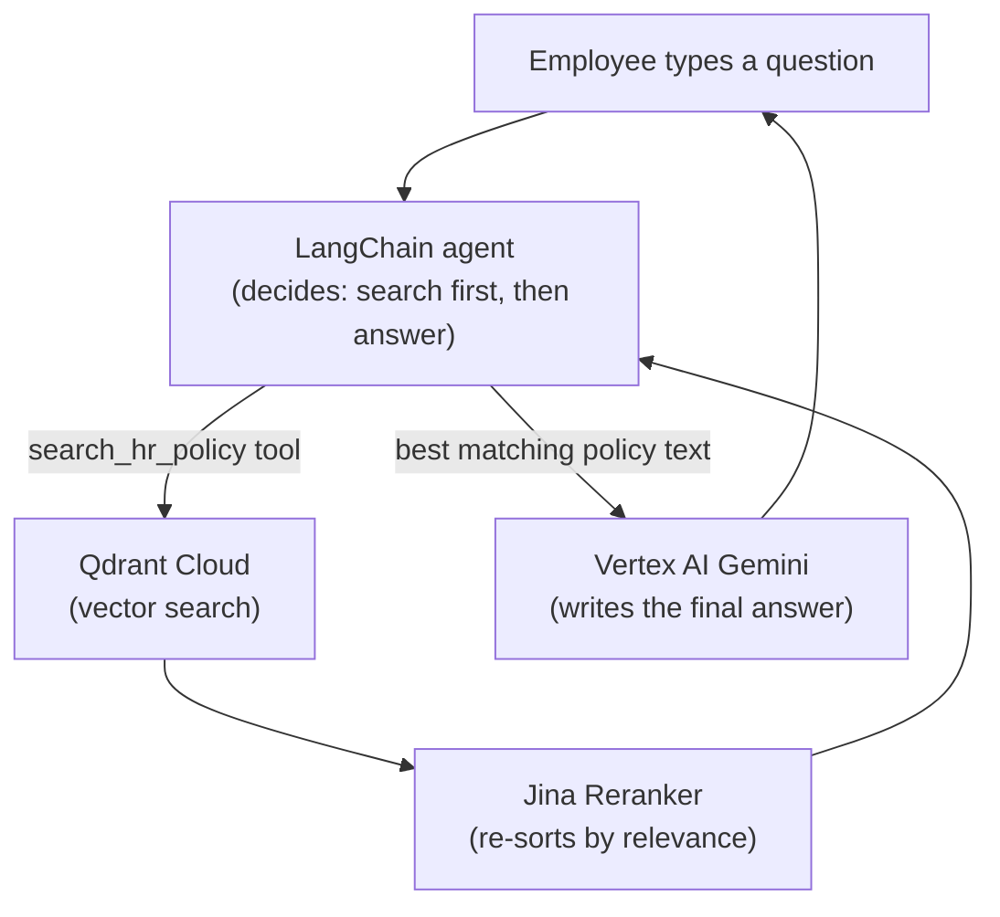

# 02. Tech Stack

In one sentence: **LangChain** wires the pieces together, **Vertex AI
Gemini** writes the answers (with **LiteLLM** falling back to **Groq** if it
errors), **Jina** turns text into searchable numbers, **Qdrant** stores and
searches them, **Streamlit** is the chat window, **Docker + Cloud Run** is
the hosting, and **Google OAuth + Model Armor** keep it safe.

## How a question becomes an answer

## Components

| Component | Role | Why this one |
|---|---|---|
| **LangChain** (`langchain`, `langchain-core`) | Orchestration — the agent, the search-tool pattern (`create_agent` + `@tool`), deciding when to search vs. answer | Industry-standard pattern |
| **LangGraph** (`langgraph`) | Short-term memory (`InMemorySaver`) and a debuggable graph | LangChain's agent runtime is built on it |
| **Vertex AI Gemini** (`langchain-google-genai`, `gemini-2.5-flash`) | The model that reads retrieved text and writes the answer | Google's model, called through Google Cloud — auth, billing, governance in one place |
| **Jina AI** (`jina-embeddings-v2-base-en`, `jina-reranker-v2-base-multilingual`) | Embeddings for search + reranking to re-sort results by true relevance | A deliberately non-GCP provider — a real multi-vendor stack |
| **Qdrant Cloud** | The vector database | Fast setup, native hybrid search + metadata filtering, stays running |
| **Vertex AI Model Armor** | Screens questions in and answers out for prompt injection, jailbreaks, unsafe content | Google's purpose-built safety-screening service — see doc 15 |
| **Streamlit** | The web chat UI and the Google-login screen (`st.login` / `st.user`) | Python script → web app, with built-in Google OAuth |
| **Docker** | Packages code + dependencies into one portable image | Standard way to make "runs anywhere" |
| **Google Cloud Run** | Hosts the chatbot as one auto-scaling service | Serverless, scales to zero, built-in IAM access control |
| **LiteLLM** (`litellm` + `langchain-litellm`, in-process) | The Router inside `hr_assistant/llm.py`: every model call asks for one logical model; LiteLLM routes it to Vertex AI Gemini, falling back to Groq (`gpt-oss-20b`) after retries on error | One place to name backends + automatic failover, without a separate service — see doc 14 |
| **Google Secret Manager** | Stores the OAuth secrets outside code and outside Cloud Run's own config | Secrets never sit in a Dockerfile, git, or plain env text |
| **LangSmith** (`langsmith`) | Two jobs: **tracing** (with `LANGSMITH_TRACING=true`, the full request flow — retrieval → guardrail → cache → LLM — as a trace tree) and **evaluation** (datasets + experiments for `evaluate.py`) | Standard LangChain observability + eval platform; the app runs fine without it |
| **openevals** (`openevals`) | The LLM-as-judge prompts (`CORRECTNESS_PROMPT`, `RAG_GROUNDEDNESS_PROMPT`) the evaluation uses | Maintained by LangChain, made to plug into LangSmith's `evaluate` |
| **Groq** | Two roles: the app's **fallback model** (`gpt-oss-20b`, via the LiteLLM Router) and the **judge model** for `evaluate.py` (`openai/gpt-oss-120b`, scoring correctness + groundedness) | A different model family from the app's Gemini — the fallback keeps answering if Vertex errors, and the judge isn't the app's own model grading itself. OpenAI-API-compatible |
| **Docker Compose** (`docker-compose.yml`) | Local run — `docker compose up` for the app, `docker compose run eval` for one evaluation | Convenience for running locally in a container; production is Cloud Run |

## Two libraries worth calling out

- **`fastembed`** — computes the sparse (keyword) half of hybrid search
  locally. It needs a one-time model file from HuggingFace, which caused a
  real deploy bug (doc 12) — baking the file into the image fixed it.
- **`Authlib`** — the OAuth library Streamlit's `st.login()` uses under
  the hood.

Next: **[doc 03 — Document Processing](03-document-processing.md)**.
