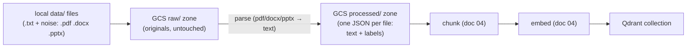

# 03. Document Processing & Ingestion

## The ingestion pipeline

Ingestion is its **own** step, run once with `python ingest.py`. Nothing
else embeds or upserts — `main.py`, `app.py`, and `evaluate.py` just
connect to the Qdrant collection ingestion already built.



`ingest.py` is **idempotent**: if the Qdrant collection already has data,
it's skipped. `--force` rebuilds it. `main.py` / `app.py` also bootstrap
ingestion automatically on a completely fresh setup, so the first run just
works — after that, startup is only a connect.

## Getting a file into the program correctly

Each file starts with a line like `Policy Category: Leave` — that line
becomes the `policy_category` label. Every chunk carries its `source`
filename and `policy_category` forward, so an answer can always be traced
to one file (needed for citations, and for the category filter in doc 06).

```python
from hr_assistant.document_loader import load_documents_from_gcs

documents = load_documents_from_gcs()
print(documents[0].metadata)   # {'source': 'leave_policy.txt', 'policy_category': 'Leave', ...}
```

## Why parsing is its own stage

The reliability corpus (doc 09) adds 8 non-HR documents in PDF, Word, and
PowerPoint. Parsing those is slow, so it happens **once**:

- **raw/** — files exactly as they arrived. Never read by the chunk/embed
  step directly.
- **processed/** — one JSON record per file (parsed text + labels),
  written by `hr_assistant/processor.py` during ingestion.
- Chunking and embedding read **processed/** only.

## Watch out for

- Losing the `source` filename — then you can't cite or filter.
- A reworded `Policy Category:` line — the label won't match the filter
  list (`HR_POLICY_CATEGORIES`) and that policy silently drops out of
  guarded search.

Next: **[doc 04 — Chunking & Embeddings](04-chunking-and-embeddings.md)**.
