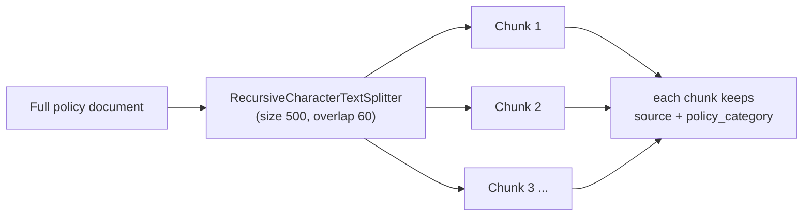
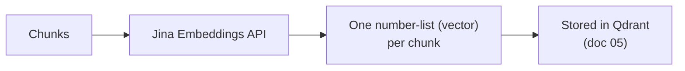

# 04. Chunking & Embeddings

Two steps that turn whole documents into something a computer can search.

## Chunking — cut each document into small pieces

A whole policy document is too big to search well. So each document is cut
into small overlapping pieces ("chunks"), about 500 characters each, with
60 characters of overlap so a sentence split across a boundary still makes
sense in both pieces.



- **Too big** → retrieval gets vague, and you hand the model a lot of
  irrelevant text.
- **Too small** → you lose the surrounding context a question needs.
- The labels (`source`, `policy_category`) carry over onto every chunk
  automatically.

```python
from hr_assistant.splitter import split_into_chunks
chunks = split_into_chunks(documents)
```

## Embeddings — turn each chunk into a list of numbers

An **embedding** is a list of numbers that captures the *meaning* of a
piece of text. Two chunks about the same thing get similar number lists.
That's what makes "search by meaning" possible.

This project uses **Jina** for embeddings (not Google) — a deliberate
choice to show a real multi-vendor stack. Jina uses a plain API key
(`JINA_API_KEY`), unlike Google services which use account-based auth.



```python
from hr_assistant.embeddings import get_embeddings_model
model = get_embeddings_model()
vectors = model.embed_documents([c.page_content for c in chunks[:3]])
print(len(vectors), len(vectors[0]))   # 3 vectors, each ~768 numbers long
```

## Watch out for

- **Never mix embeddings from two different models in the same store.**
  The question and the documents must be embedded by the *same* model or
  the "similar meaning = similar numbers" rule breaks silently.
- Embedding happens only in `ingest.py` (stable chunk IDs make re-ingestion
  an upsert, not a duplicate). `main.py` / `app.py` never re-embed.

Next: **[doc 05 — Retrieval & Vector Storage](05-retrieval-and-vector-storage.md)**.
