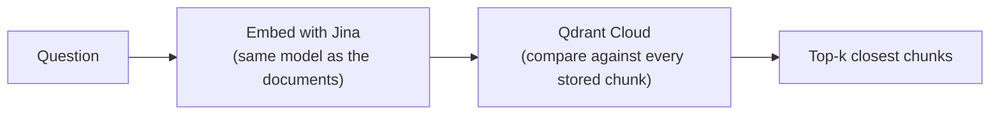

# 05. Retrieval & Vector Storage

## What "retrieval" means

Take the question, turn it into a number-list with the **same** Jina model
used for the documents, and ask the vector store for the chunks whose
number-lists are closest. Those are the most likely to answer the question.



## The vector store: Qdrant Cloud

A **vector store** is a database built to do "find the closest number
lists" fast. This project uses **Qdrant Cloud** (free tier). A named set
of vectors in Qdrant is called a **collection**.

Adding chunks is an **upsert** (insert-or-update): re-ingesting the same
chunks overwrites them instead of making duplicates, because each chunk
gets a stable ID derived from its source + text.

Two functions, kept apart on purpose:

- `build_vector_store(chunks, ...)` — embed + upsert. Only `ingest.py`
  calls this.
- `load_vector_store(name)` — connect to an existing collection, no
  embedding. `main.py` / `app.py` / `evaluate.py` connect this way; it
  raises a "run ingest.py" message if the collection isn't there (the
  `build_hr_assistant` / `build_reliability_assistant` builders catch that
  and bootstrap ingestion once).

```python
from hr_assistant.vector_store import load_vector_store, get_retriever

vector_store = load_vector_store()             # connect (no re-embed)
retriever = get_retriever(vector_store)
results = retriever.invoke("How many days of paid annual leave do I get?")
for r in results:
    print(r.metadata["source"], "-", r.page_content[:120])
```

## Watch out for

- The query **must** use the same embedding model as the documents.
- `k` too low → you miss a relevant chunk. `k` too high → you drown the
  model in noise. Re-ranking (doc 07) is what fixes a wide `k`.

Next: **[doc 06 — Metadata Filtering & Hybrid Search](06-filtering-and-hybrid-search.md)**.
