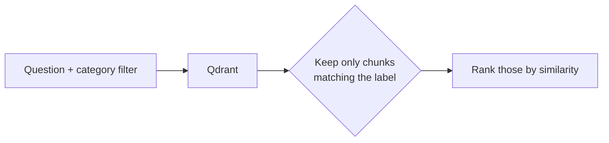
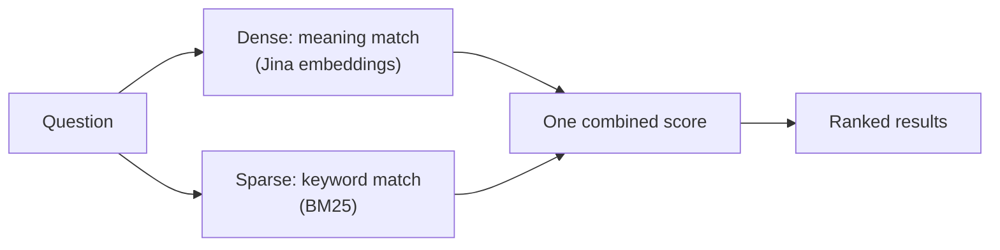

# 06. Metadata Filtering & Hybrid Search

Two ways to make retrieval results better.

## Metadata filtering — a hard yes/no gate

Similarity search is a *soft* signal: a chunk from the wrong policy can
still score high if the wording overlaps. A **filter** adds a hard rule on
top — "only look at chunks labelled `Notice Period`" — before similarity is
even considered.



```python
# no filter — a notice-period question may pull in Leave chunks too
get_retriever(vector_store).invoke("What happens to my leave during notice period?")

# filtered — only the Notice Period policy is considered (a one-element
# allow-list; pass config.HR_POLICY_CATEGORIES for the full scope guardrail)
get_retriever(vector_store, filter_categories={"Notice Period"}).invoke(
    "What happens to my leave during notice period?"
)
```

This same filter is the backbone of the **scope guardrail** later (doc 15):
restrict retrieval to the list of HR categories and non-HR chunks become
impossible to return.

**Don't over-filter.** Some questions genuinely span two policies (leave
*and* notice period) — forcing one category then hurts the answer.

## Hybrid search — meaning search + keyword search together

Some questions are really keyword questions in disguise: an exact number
(`60 days`), a specific term. Pure meaning-search can under-rank the chunk
that has the exact right word if the rest of its phrasing doesn't match.

**Hybrid search** runs both and blends them into one score:



It's **one combined ranking**, not two separate result lists. `ingest.py`
always builds the collections in hybrid mode.

The sparse (keyword) half runs locally via `fastembed`, which needs a
one-time model download — the source of a real deploy bug later (doc 12).

Next: **[doc 07 — Re-ranking](07-re-ranking.md)**.
