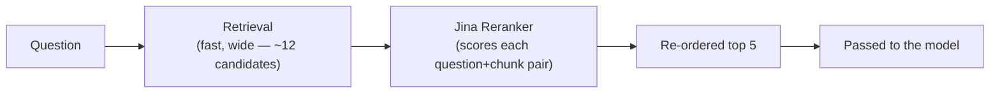

# 07. Re-ranking

## The idea

Retrieval is built for **speed** across thousands of chunks, so it's a bit
rough. Re-ranking takes just the shortlist retrieval returned and re-scores
each chunk with a slower, more accurate model that reads the question and
the chunk *together*.

Cheap-and-fast first, expensive-and-accurate on the survivors — the
standard RAG pattern.



## How it works here

- Retrieval pulls a **wide** shortlist (`RERANK_CANDIDATE_K = 12`).
- The **Jina Reranker** (`jina-reranker-v2-base-multilingual`), called over
  a plain REST API, scores every pair and returns the best.
- The top `TOP_K_RESULTS = 5` go to the model.

```python
from hr_assistant.reranker import rerank

candidates = get_retriever(vector_store, k=12).invoke(
    "Can I take annual leave right before my last day?"
)
top = rerank("Can I take annual leave right before my last day?", candidates, top_n=5)
```

The reranker also returns a **relevance score** per chunk. The guarded
search tool — which every real code path now uses, the deployed app
included — uses that score as a cutoff: if the best chunk scores below a
threshold, the tool reports "not found" instead of returning a weak match
(doc 15).

## Watch out for

- Re-ranking can only re-order what retrieval already found — it can't
  bring back a chunk retrieval missed.
- Only re-rank a modest shortlist (10–20), never the whole store — the
  model is slow per pair.

Next: **[doc 08 — The Agent](08-the-agent.md)**.
