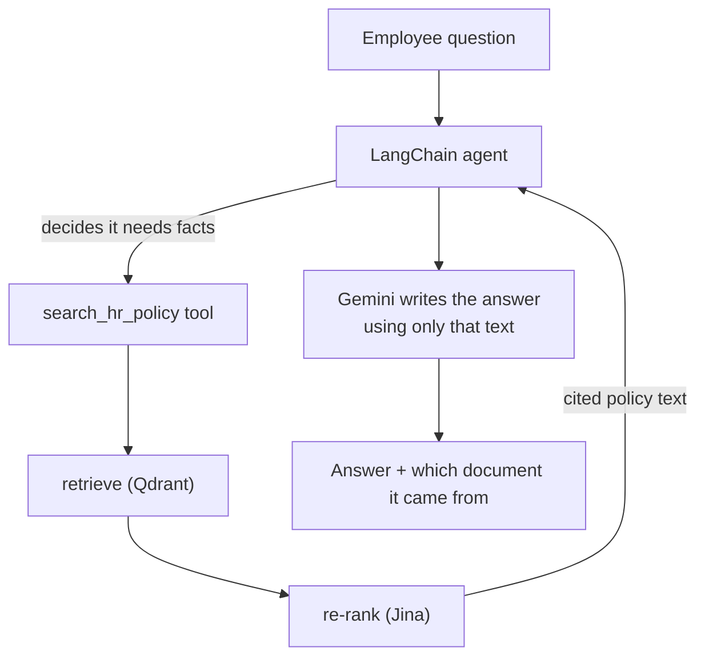

# 08. The Agent

Docs 03–07 built the search pipeline. This doc is how the model actually
uses it to answer a question.

## The pieces

| File | Job |
|---|---|
| `hr_assistant/llm.py` | Connects to the model — Vertex AI Gemini, with a Groq fallback via the LiteLLM Router (doc 14) |
| `hr_assistant/tools.py` | Wraps "retrieve → re-rank → return cited text" as one tool the model can call |
| `hr_assistant/agent.py` | Builds the agent: model + tool + system prompt + memory |
| `hr_assistant/pipeline.py` | The single entry point `main.py` and `app.py` both call |

## How a question flows

The **system prompt** tells the model the rules: always search before
answering, never answer from your own knowledge, say "I don't know" if the
text doesn't have it, always cite the document, and never adopt a
different name or persona (the "identity lock" — see doc 15). Every real
code path uses the reinforced `RELIABILITY_SYSTEM_PROMPT`; the plain
`SYSTEM_PROMPT` is now only the red-team baseline.

## Memory

The agent has a **checkpointer** (`InMemorySaver`). Calls that share a
`thread_id` remember earlier turns; a new `thread_id` starts fresh. This is
what lets a follow-up like *"and in more detail?"* work — without it, the
agent would re-search from scratch with no idea what "it" refers to.

- `main.py` / CLI — one default thread.
- `app.py` / Streamlit — one thread per browser session, reset by the
  "New conversation" button.

## The builds of the agent

| Function | Collection | Tool | Returns | Used by |
|---|---|---|---|---|
| `build_hr_assistant()` | clean `hr_policies` | **guarded** | `(agent, cache)` | `main.py`, `app.py` (**the deployed app**) |
| `build_reliability_assistant()` | mixed `hr_policies_noisy_demo` | **guarded** | `(agent, cache)` | `demo_reliability.py`, `redteam_test.py` |
| `build_plain_assistant()` | clean `hr_policies` | plain (no filter, no score floor) | `agent` | `redteam_test.py` baseline only |

`build_hr_assistant()` and `build_reliability_assistant()` are the same
guarded stack — same tool, same `RELIABILITY_SYSTEM_PROMPT`, same semantic
cache — differing only in which collection they point at.
`build_plain_assistant()` exists solely so `redteam_test.py` can show the
before/after; nothing user-facing uses it.

Both **connect** to a Qdrant collection that `ingest.py` already built —
they don't re-embed on startup. If the collection is missing on a fresh
setup, they bootstrap ingestion once, then connect.

> The deployed app runs the **guarded** build wrapped in the full safety
> pipeline (input/output Model Armor + semantic cache) — see doc 09 for the
> flow and doc 15 for the guardrail layers.

Next: **[doc 09 — Reliability](09-reliability.md)**.
