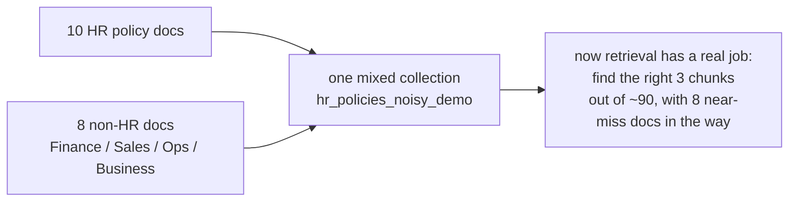
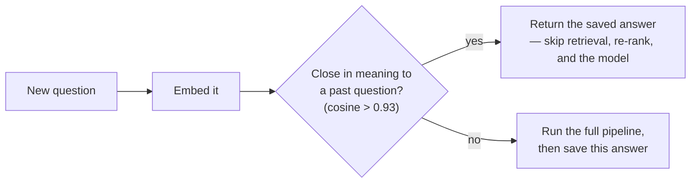
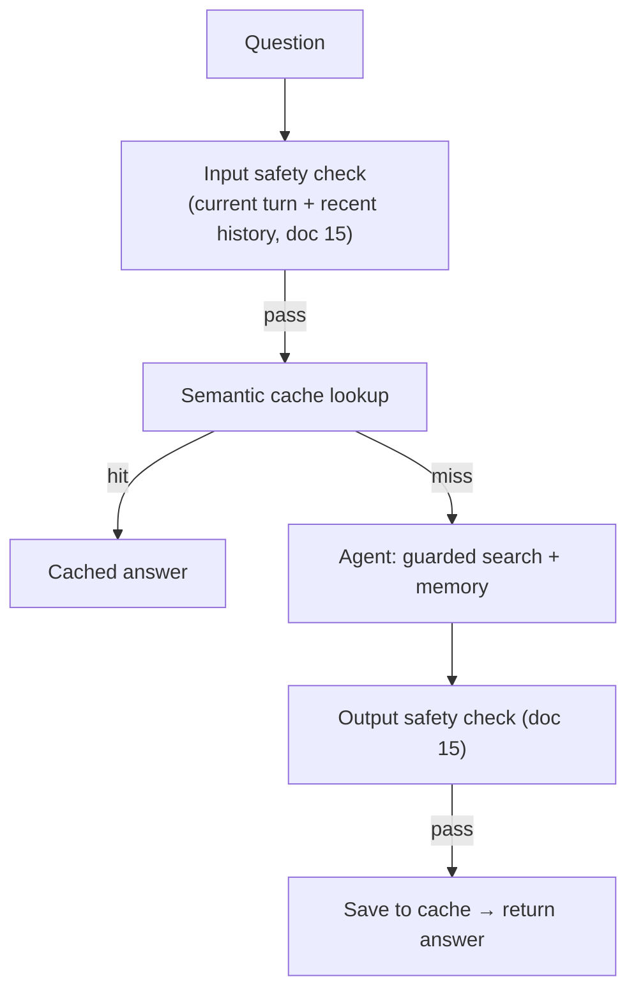

# 09. Reliability: Noisy Corpus, Memory & Semantic Cache

Docs 03–08 worked on a clean set of 10 HR documents. Real data is never
that tidy. This doc adds what it takes to stay correct when other
departments' documents are sitting in the same search space, and when
people ask the same thing twice.

*(Content safety — blocking prompt injection and keeping the assistant
in-scope — is doc 15.)*

## The noisy corpus

The reliability build mixes **8 non-HR documents** (Finance, Sales,
Operations, Business — in PDF, Word, PowerPoint, and text) into the **same
Qdrant collection** as the HR docs. Some of them deliberately borrow
HR-sounding words ("leave", "notice", "reimbursement") in passing.

Putting the noise in a *separate* collection would make the test
meaningless — you'd never search it. Mixing them is the point.

> There are **two** collections total: `hr_policies` (clean — used by the
> deployed app and `evaluate.py`) and `hr_policies_noisy_demo` (mixed —
> used by `demo_reliability.py` and `redteam_test.py`). `ingest.py` builds
> both. Not one collection per data type. The deployed app runs the same
> guarded search tool against its clean collection — the category filter is
> near-redundant there, but the relevance-score floor still turns a weak
> match into a clean "I don't have that".

## Short-term memory

Same as doc 08: the agent's checkpointer remembers earlier turns per
`thread_id`. This is what makes a follow-up like *"and what happens to that
leave during my notice period?"* resolve correctly instead of triggering a
fresh, unrelated search. The same per-thread history is also fed to the
input safety check (doc 15), so a multi-turn attack that looks harmless one
message at a time is still screened in aggregate.

## Semantic cache

Before doing any work, the pipeline checks: **has someone already asked
this?** Not word-for-word — it embeds the new question and compares it by
meaning to past questions.

*"How many leave days do I get?"* and *"How many days of paid annual leave
am I entitled to per year?"* are different words, same question — the
second one is a cache hit.

**Threshold matters:** too low (below ~0.9) and it returns cached answers
for questions that are only loosely similar.

**Bounded on purpose:** the cache is capped
(`SEMANTIC_CACHE_MAX_ENTRIES`, oldest evicted) and each entry expires
(`SEMANTIC_CACHE_TTL_SECONDS`, default 1 hour) — so a long-running process
doesn't grow without limit and a cached answer can't outlive a policy
change + re-ingest. It's in-memory, so it's per-process and clears on
restart.

## What runs, in order

This is `pipeline.ask()` — **the default path** for `app.py` and `main.py`,
not just the demo.

On an input-check **error** (not a block — an API failure) the request is
refused; on an output-check error the answer is returned anyway and the
failure is logged. See doc 15.

Next: **[doc 10 — Evaluation & Red-Teaming](10-evaluation-and-redteam.md)**.
