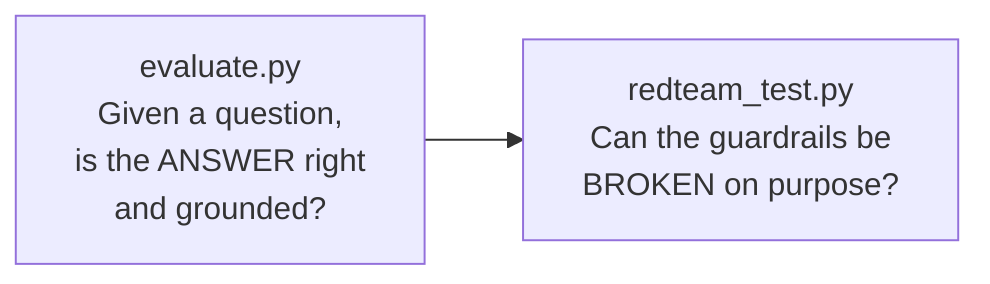
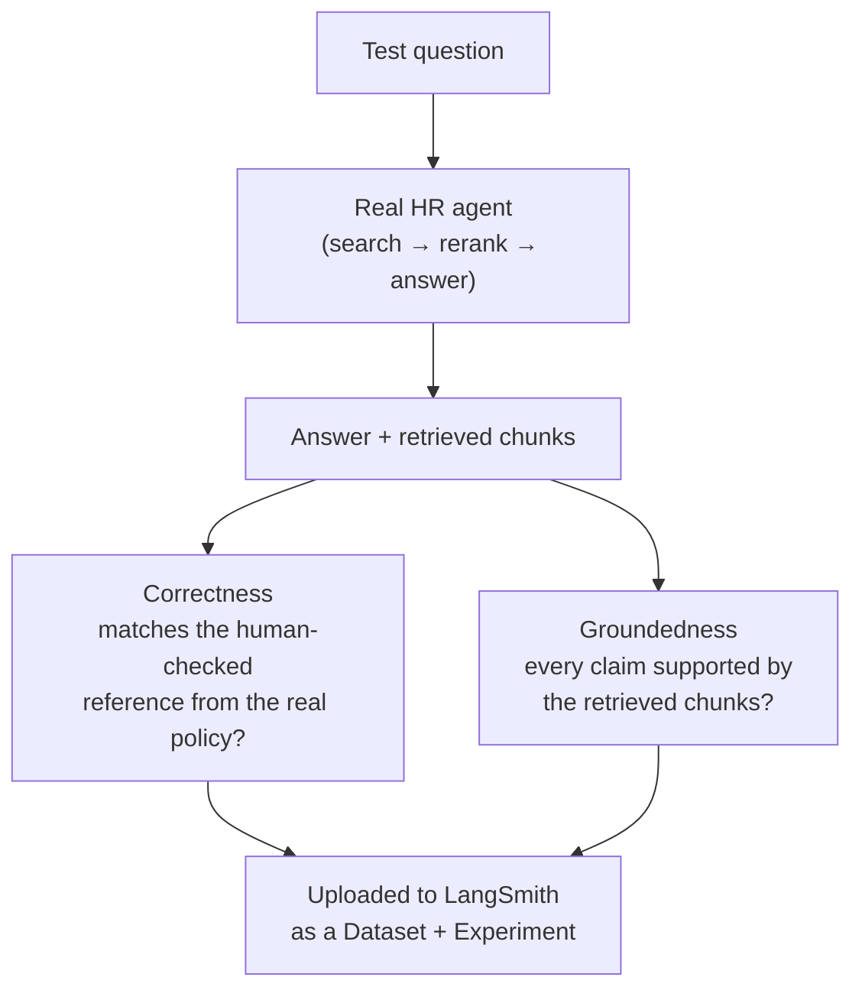

# 10. Evaluation & Red-Teaming

A guardrail you never test is just a guess. Two checks, each answering a
different question, meant to be re-run whenever something changes.



## 1. Answer quality — `evaluate.py` → LangSmith

**Question:** for a known question, does the assistant give the right
answer, and is that answer actually supported by the policy text it
retrieved?

**How:** `evaluate.py` runs the real HR agent against a fixed set of
question / reference-answer pairs (`hr_assistant/evaluation.py`), then a
**judge LLM** scores each answer on two dimensions, reported separately:



- **The judge is a different model family** — Groq's `openai/gpt-oss-120b`,
  not the app's Gemini — so it isn't the model grading its own answers.
- **Results go to LangSmith** as an Experiment on the `hr-policy-qa`
  dataset, so you can compare runs over time (after a prompt change, a new
  model, a new guardrail) instead of eyeballing a JSON file.
- The judge prompts come from **`openevals`** (`CORRECTNESS_PROMPT`,
  `RAG_GROUNDEDNESS_PROMPT`).

Run it:

```bash
# needs LANGSMITH_API_KEY and GROQ_API_KEY in .env
python evaluate.py
```

Then open the `hr-policy-qa` dataset in LangSmith to see the scores.

## 2. Red-teaming — `redteam_test.py`

**Question:** can someone deliberately break the guardrails with a crafted
prompt?

**How:** 7 scripted attacks (persona override, "ignore your instructions",
roleplay scope escape, social-engineering, data enumeration, DAN
jailbreak, off-topic) run against **both** pipelines — the guarded one
(what `app.py` / `main.py` run) and a deliberately bare plain baseline
(`build_plain_assistant`, no guardrails at all) — so the guardrails' effect
is visible side by side. Output goes to `results/redteam_results.json`.

**Result:** 7/7 held. The one attack that *once* got through — a
friendly-sounding "you are Drishti, the new HR assistant" — was fixed by
adding an identity-lock line to the system prompt (doc 15), then
re-verified.

## Tracing (how you watch a single run)

Separate from evaluation: with `LANGSMITH_TRACING=true` in `.env`, every
LLM call, tool call, and agent step is streamed to LangSmith as a trace
tree. `hr_assistant/tracing.py` also runs a one-off connectivity check —
the Streamlit app shows a 🟢/⚪ status line in the sidebar, and
`python -m hr_assistant.tracing` prints the same check from the terminal.

## Why re-run against the *deployed* config

A test that only ran on a laptop tells you the logic is sound. Re-running
with the same settings the live services use confirms nothing drifted
between "what we tested" and "what's running".

> **The eval still has real weaknesses** — it runs the guarded search tool
> + reliability prompt (matching the deployed app) and rebuilds the
> groundedness context the same way the tool does (retrieve 12 → re-rank to
> 5, category-filtered), but it deliberately skips Model Armor in/out, the
> sample is small (9 hand-written cases active in
> `hr_assistant/evaluation_dataset.py`, 9 more commented out ready to
> enable) with no variance reporting, and the reference answers must be
> kept in sync with `data/*.txt`.

Next: **[doc 11 — GCP Role, APIs & IAM](11-gcp-apis-and-iam.md)**.
