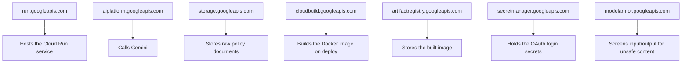

# 11. GCP Role, APIs & IAM

## What Google Cloud does here

Four jobs — everything else in the stack (Qdrant, Jina) is not Google's:

1. **Runs the model** — Vertex AI hosts Gemini.
2. **Stores the documents** — Cloud Storage holds the raw policy files.
3. **Hosts the app** — Cloud Run runs both web services.
4. **Controls who can do what** — IAM decides which piece may call which
   other piece; Secret Manager keeps login secrets locked away.

Project: **`rag-hr-assistant-demo`**, region **`us-central1`** everywhere.

## APIs turned on

Nothing works until the matching API is switched on for the project.

| API | Without it… |
|---|---|
| `run.googleapis.com` | Can't deploy or run the service |
| `aiplatform.googleapis.com` | No answers — the model is unreachable |
| `storage.googleapis.com` | No documents to search |
| `cloudbuild.googleapis.com` | `gcloud run deploy --source .` can't build the image |
| `artifactregistry.googleapis.com` | Nowhere to store the built image |
| `secretmanager.googleapis.com` | The app can't read its login config — `st.login()` breaks |
| `modelarmor.googleapis.com` | The safety guardrail has nothing to call |

## Permissions granted (least privilege)

The Cloud Run service runs as the **default compute service account**.
Each permission was added only when something actually needed it.

| Role | Lets the app… | Kept narrow because |
|---|---|---|
| `roles/aiplatform.user` | Call Gemini | Can *use* the model, not create/delete Vertex AI resources |
| `roles/storage.objectViewer` | **Read** files from the bucket | Read-only — the app never writes or deletes documents |
| `roles/modelarmor.user` | Call the Model Armor screening API | Can use a template, not edit one |
| `roles/secretmanager.secretAccessor` *(on the one `streamlit-auth` secret only)* | Read the OAuth config at startup | Scoped to a single secret — can't read any other |

The Groq fallback model is reached with a plain `GROQ_API_KEY` env var, not
an IAM role — Groq is outside GCP.

## Two kinds of "permission" in this project

- **Human permissions** — which *people* can use the app (the employee
  allow-list, doc 13).
- **Machine permissions** — which *service account* can call which *API*
  (the roles above).

Both are enforced automatically, not written down and hoped for.

Next: **[doc 12 — Containerization & Cloud Run](12-containerization-and-cloud-run.md)**.
