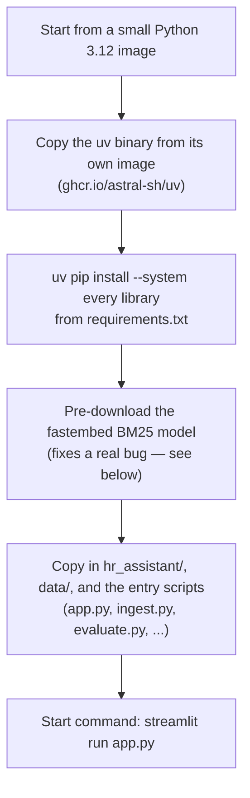

# 12. Containerization & Cloud Run

## What "containerizing" means

The app used to run only on one laptop with Python installed and a
hand-filled `.env`. **Docker** packages the app *and* everything it needs
(Python version, libraries, startup command) into one self-contained
**image**. Cloud Run takes that image and runs it as a live web service.

## The Dockerfile, in plain steps



- Dependencies install with **`uv`** (fast), pulled straight from the
  `ghcr.io/astral-sh/uv` image via `COPY --from` — no `pip`/`curl` step.
  `--system` because a container needs no separate virtualenv.
- `.dockerignore` keeps `.env`, `.streamlit/secrets.toml`, `deploy.env.yaml`,
  `docs/`, and `results/` out of the image — secrets never belong in an
  image.
- `data/` **is** in the image, so `docker compose run ingest` can push the
  corpus to GCS from the container. The image also carries every entry
  script (`ingest.py`, `evaluate.py`, ...) so `docker compose run` works.

## Running it locally with Docker Compose

`docker-compose.yml` is for local runs only (production is Cloud Run):

```bash
docker compose up            # the app at http://localhost:8501
docker compose run --rm eval # one LangSmith evaluation run, then exit
```

Both read secrets from `.env` and mount your local gcloud credentials
(`~/.config/gcloud`, or `%APPDATA%\gcloud` on Windows via `GCLOUD_CONFIG`)
so the container can reach Vertex AI and Cloud Storage. Without a Streamlit
`[auth]` secrets file mounted, the app runs in "open local mode" — no
Google login — instead of crashing.

## A real bug hit on the first deploy

The app built fine but crashed on startup:

```
ValueError: Could not load model Qdrant/bm25 from any source.
```

**Why:** hybrid search (doc 06) needs a small BM25 model file. `fastembed`
downloads it from HuggingFace *the first time it's needed* — which on Cloud
Run is every cold start, because containers keep no disk between starts.
HuggingFace rate-limited Cloud Run's shared outbound IP (`429`) before the
download finished.

**Fix:** move the download from *runtime* to *build time* — one line in the
Dockerfile:

```dockerfile
RUN python -c "from fastembed import SparseTextEmbedding; SparseTextEmbedding(model_name='Qdrant/bm25')"
```

Now the file is baked into the image and the running container never calls
HuggingFace. Classic "worked on my laptop" bug — the laptop kept its
downloaded files between runs; a fresh-every-time environment didn't.

## The deploy

```bash
gcloud run deploy hr-rag-assistant \
  --source . \
  --project=rag-hr-assistant-demo \
  --region=us-central1 \
  --allow-unauthenticated \
  --set-secrets=/app/.streamlit/secrets.toml=streamlit-auth:latest \
  --env-vars-file=deploy.env.yaml
```

- `--source .` — Cloud Build turns the Dockerfile into a running service
  in one command; no manual `docker build` / `docker push`.
- `--allow-unauthenticated` — anyone can *load the page*. This is **not**
  the security hole it looks like: the real gate is inside the app (Google
  login + employee allow-list), not at Cloud Run's network layer. Doc 13
  explains why.
- `--env-vars-file=deploy.env.yaml` — non-secret config + the Qdrant / Jina
  / Groq API keys, from a **gitignored** local YAML file. YAML (not a
  `--set-env-vars` string) because `ALLOWED_EMPLOYEE_EMAILS` contains
  commas. Visible only to people with access to the service config; never
  committed.
- `--set-secrets=…=streamlit-auth:latest` — mounts the OAuth `secrets.toml`
  from Secret Manager into the container at `/app/.streamlit/secrets.toml`,
  which is where Streamlit looks for it. This is what flips the app from
  "open local mode" to enforcing the login gate.

Full command list: **[commands.md](../commands.md)** Phases 10–11. Hitting
`redirect_uri_mismatch` or a login loop? **[doc 17](17-troubleshooting.md)**.

Next: **[doc 13 — Access Control](13-access-control.md)**.
