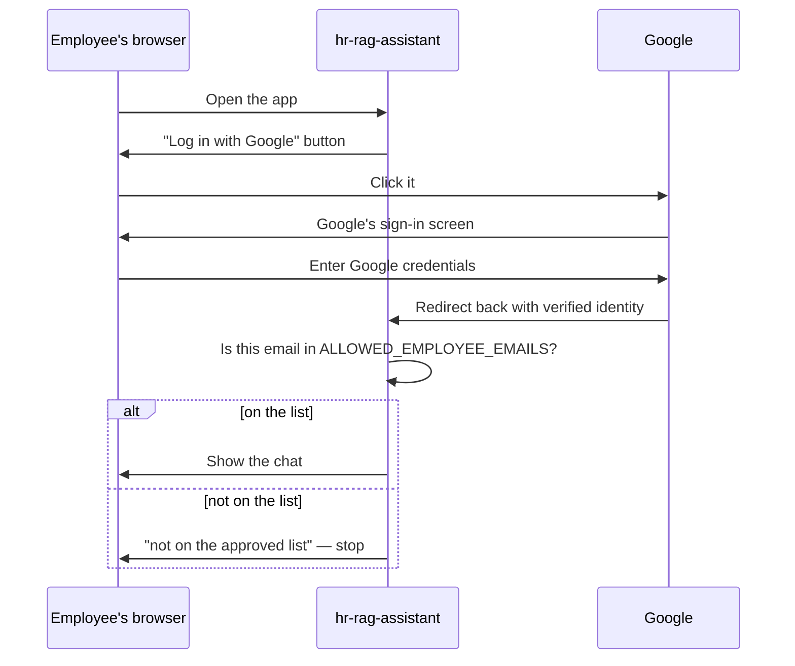
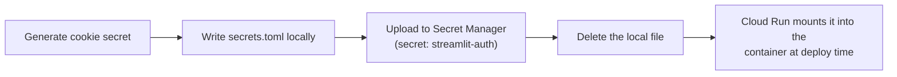

# 13. Access Control (OAuth + Allow-List)

## The goal

Only actual employees on an approved list should ever chat with the
assistant. Everyone else sees a login screen and gets no further.

## Why Cloud Run itself isn't the gate

The simple option — make the Cloud Run service private — would mean only
people with a Google Cloud account *in this project* could reach it. Real
employees don't have that. So instead:

- Cloud Run is **public** (`--allow-unauthenticated`) — anyone can load
  the page.
- The **app itself** decides who gets past the login screen.

## The login flow

**Two independent checks must both pass:**

1. **Google's consent screen "Testing" mode** — while the OAuth screen is
   in *Testing*, Google itself only lets an email log in if it's on the
   **Test users** list in the Cloud Console. This happens on Google's side,
   before the app sees anything.
2. **The app's own `ALLOWED_EMPLOYEE_EMAILS` list** — a second check inside
   `app.py`. Even a valid Google test user is rejected here if their email
   isn't listed.

Same emails in both lists today, enforced by two unrelated systems on
purpose — belt and suspenders.

## Where the login secrets live

Google OAuth needs three secret values: a **client ID**, a **client
secret** (both from Google when the OAuth client was created), and a
**cookie-signing secret** (a random value generated with
`openssl rand -hex 32` to sign the "stay logged in" cookie).

None of these live in code or in a `.env` on the server.

The `secrets.toml` also carries a **`redirect_uri`** — where Google returns
the user after login. Two rules that cause almost every OAuth failure:

- It **must end in `/oauth2callback`** — that's the only path Streamlit's
  login handler listens on. A bare URL makes login silently loop.
- The string here must match a URI on the OAuth client's **Authorized
  redirect URIs** list **character-for-character** (`https`, no trailing
  slash, exact host). A mismatch is `Error 400: redirect_uri_mismatch`.

So the OAuth client needs `https://<cloud-run-url>/oauth2callback`
registered, and (for local testing) `http://localhost:8501/oauth2callback`
too. Full symptoms + fixes: **[doc 17 — Troubleshooting](17-troubleshooting.md)**.

## Adding or removing an employee

Two steps, because two systems enforce access:

1. **Cloud Console** → add/remove the email under OAuth **Test users**.
2. **Redeploy** with an updated `ALLOWED_EMPLOYEE_EMAILS`.

Miss either step and that person is blocked.

Next: **[doc 14 — LLM Routing & Fallback](14-llm-routing.md)**.
