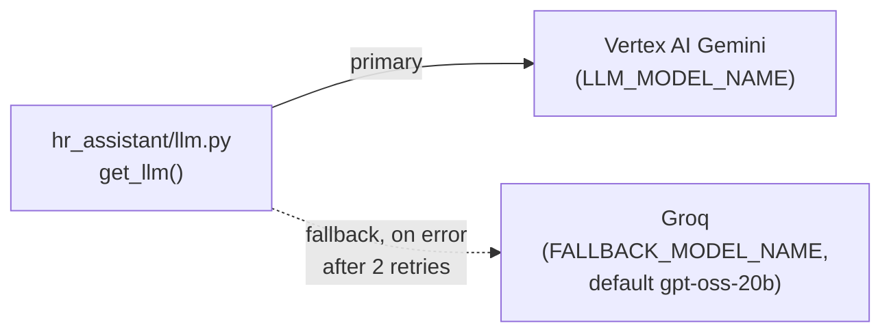

# 14. LLM Routing & Fallback

## Why put anything between the app and the model

The app could call Vertex AI Gemini directly. That works until the call
fails — a quota hit, a regional blip, a 5xx. Then the whole request dies,
even though a perfectly good backup model exists.

So every model call goes through **one function**, `get_llm()` in
`hr_assistant/llm.py`, which returns a chat model backed by a **LiteLLM
Router**:

The calling code (`agent.py`, `guardrails.py`) only ever asks for one
logical model. The Router decides what serves it. Swapping or reordering
backends is a change in `llm.py` + `config.py` and nowhere else.

## Primary + fallback

`hr_assistant/llm.py` builds a `litellm.Router` with two deployments:

- **primary** — `vertex_ai/<LLM_MODEL_NAME>` (default `gemini-2.5-flash`),
  authenticated with plain Application Default Credentials — the same
  credentials a direct Gemini call would use.
- **fallback** — `groq/<FALLBACK_MODEL_NAME>` (default
  `openai/gpt-oss-20b`), used only after the primary errors `num_retries`
  (2) times. Needs `GROQ_API_KEY`; without it the primary still works and
  the fallback simply can't fire.

`litellm.drop_params = True` so a param Gemini accepts but Groq's
OpenAI-compatible endpoint rejects doesn't 400 the fallback.

`langchain-litellm`'s `ChatLiteLLMRouter` wraps the Router as a normal
LangChain chat model — tool calling and structured output both work, so
the agent and the `gemini_lite` guardrail use it unchanged.

## LiteLLM: SDK, not a proxy service

LiteLLM has two forms. The **SDK** (used here) is a library that runs
in-process. The **proxy** is a separate server that many apps call over
HTTP, adding a shared dashboard, per-team budgets, and virtual keys.

An earlier version of this project ran the proxy as its own private Cloud
Run service. It hit a real wall:

> A shared `LITELLM_MASTER_KEY` sent as `Authorization: Bearer <key>` was
> intercepted by **Cloud Run's own IAM layer**, which reads that header and
> expects a **Google-signed ID token**, not an arbitrary string. Every
> request was rejected with a platform-level `401` before LiteLLM saw it —
> only Cloud Run's access log showed the request; LiteLLM's own log was
> empty.

The fix at the time was to mint a real Google ID token per request
(`google.oauth2.id_token.fetch_id_token`, cached ~50 min). It worked — but
with a **single app**, the whole second service plus its `roles/run.invoker`
binding and token-minting bought nothing the in-process SDK doesn't already
give: provider-agnostic calls and automatic failover both live in the
Router. So the proxy service, its Dockerfile, and the token code were all
removed. Central observability is covered by LangSmith tracing (doc 10).

If this were many apps sharing one governed model budget, the proxy would
earn its place back.

Next: **[doc 15 — Content Guardrails](15-content-guardrails.md)**.
