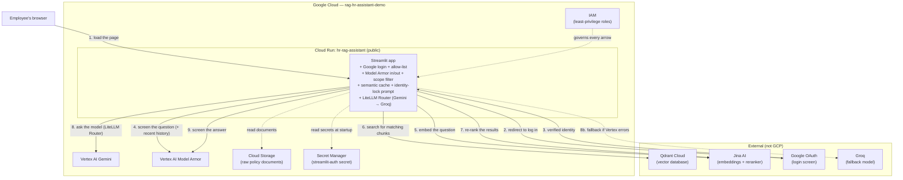

# 16. Full Hosting Architecture

Every piece from docs 01–15 in one picture. Project
`rag-hr-assistant-demo`, region `us-central1`.

*Steps 4 and 9 (Model Armor) run before the semantic-cache lookup and
after generation respectively. On step 4 a flagged question stops here; a
cache hit after step 4 skips straight to the answer, past steps 5–8.*

## Reading the diagram

- **Solid arrows** — the live path for one question, in order.
- **Dashed arrows** — background/startup access.
- **`hr-rag-assistant`** is the only service — one Cloud Run deployment.
  Public at the network level, gated by Google login + the allow-list
  before anything works.
- **Model routing** (Gemini primary, Groq fallback) is the LiteLLM Router
  *inside* that service, not a separate deployment — see doc 14.
- **IAM** isn't a step — it's the permission checks running under every
  arrow.
- **Qdrant, Jina, and Groq are outside GCP** — a deliberate multi-vendor
  stack.

## The one service

| | `hr-rag-assistant` |
|---|---|
| Who can reach it | Anyone (network) — gated by app login |
| Ingress setting | `--allow-unauthenticated` |
| What enforces access | Google OAuth + `ALLOWED_EMPLOYEE_EMAILS` |
| Its guardrails | Model Armor in/out, scope filter, identity lock, semantic cache |
| Talks to Gemini | Directly (Vertex AI), via the in-process LiteLLM Router; Groq on fallback |

## Where each secret lives

| Secret | Lives in |
|---|---|
| OAuth client ID / secret / cookie key | Secret Manager, `streamlit-auth` |
| Qdrant + Jina + Groq API keys | Cloud Run env vars on `hr-rag-assistant` |

That's the whole system. See **[commands.md](../commands.md)** to build it,
and **[doc 17 — Troubleshooting](17-troubleshooting.md)** for every error
that came up along the way.
